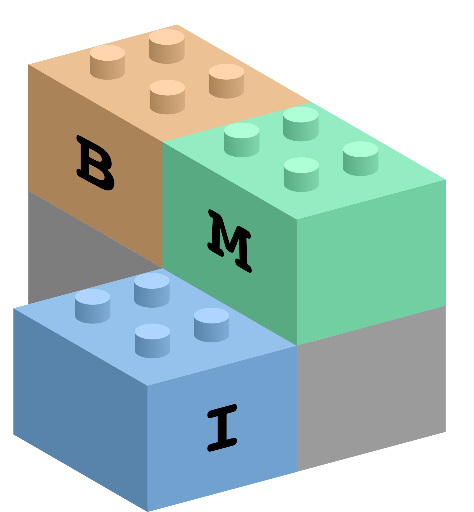

.. bmi documentation master file, created by
   sphinx-quickstart on Tue Jan  3 13:30:36 2017.
   You can adapt this file completely to your liking, but it should at least
   contain the root `toctree` directive.

=========================
The Basic Model Interface
=========================

.. include:: bmi.spec.rst

--------
See also
--------

.. toctree::
   :maxdepth: 2

   bmi.lang
   csdms
   references
