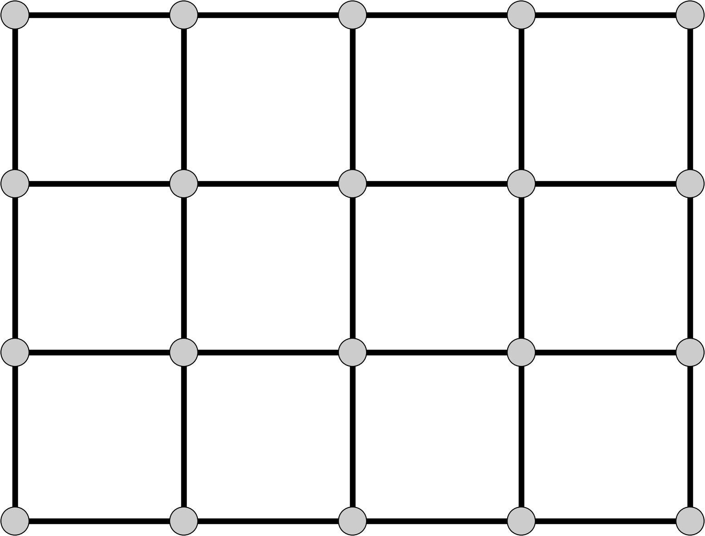
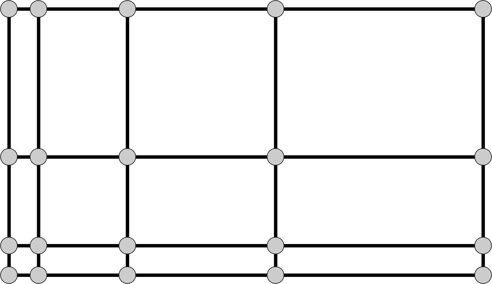
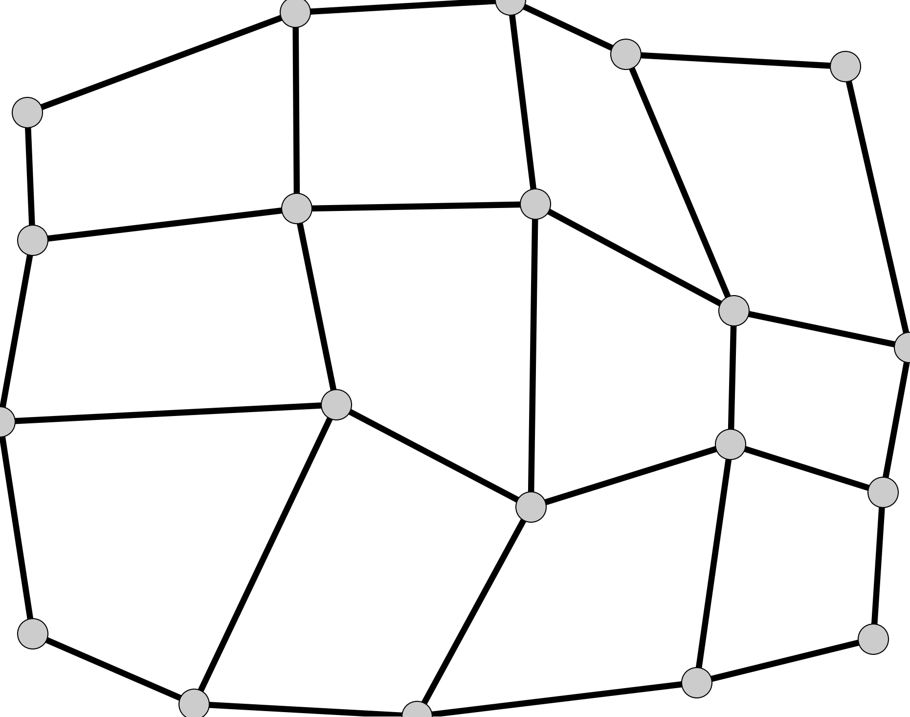
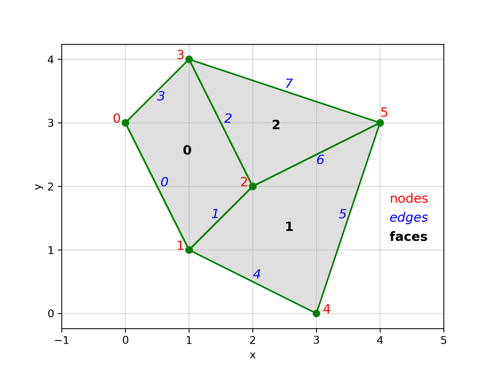

.. _model_grids:

Model grids
===========

The Basic Model Interface (BMI) supports several different :term:`grid` types,
described below.
Depending on the grid type
(as returned from the :ref:`get_grid_type` function),
a model will implement a different set of :ref:`grid functions <grid_funcs>`.

.. _structured_grids:

Structured grids
----------------

For the BMI specification,
a structured grid is formed in two dimensions by tiling a domain
with quadrilateral cells so that every interior vertex
is surrounded by four quadrilaterals.
In three dimensions, six-sided polyhedral cells are stacked such that
interior vertices are surrounded by eight cells.

In the BMI,
dimensional information is ordered with "ij" indexing
(as opposed to "xy").
For example,
for the uniform rectilinear grid shown below,
the :ref:`get_grid_shape` function would return the array ``[4, 5]``.
If there was a third dimension,
its length would be listed first.

.. note::

  The grid shape is the number of rows and columns of :term:`nodes
  <node>`, as opposed to other types of element (such as cells or
  faces). It is possible for grid values to be associated with the
  nodes or with the cells.

.. _uniform_rectilinear:

Uniform rectilinear
^^^^^^^^^^^^^^^^^^^

A uniform rectilinear grid is a special case of structured quadrilateral grid
where the elements have equal width in each dimension.
That is, for a two-dimensional grid, elements have a constant width
of ``dx`` in the *x*-direction and ``dy`` in the *y*-direction.
The case of ``dx == dy`` is oftentimes called
a *raster* or *Catesian grid*.

To completely specify a uniform rectilinear grid,
only three pieces of information are needed:
the number of elements in each dimension,
the width of each element (in each dimension),
and the location of the corner of the grid.

Uniform rectilinear grids use the following BMI functions:

* :ref:`get_grid_rank`
* :ref:`get_grid_size`
* :ref:`get_grid_shape`
* :ref:`get_grid_spacing`
* :ref:`get_grid_origin`
* :ref:`get_grid_units`

.. _rectilinear:

Rectilinear
^^^^^^^^^^^

In a rectilinear grid, the spacing between nodes in each dimension varies,
as depicted above.
Therefore,
an array of coordinates for each row and column
(for the two-dimensional case) is required.

The :ref:`get_grid_y` function provides an array (whose length is the number of
*rows*) that gives the *y*-coordinate for each row.

The :ref:`get_grid_x` function provides an array (whose length is the number of
*columns*) that gives the *x*-coordinate for each column.

Rectilinear grids use the following BMI functions:

* :ref:`get_grid_rank`
* :ref:`get_grid_size`
* :ref:`get_grid_shape`
* :ref:`get_grid_units`
* :ref:`get_grid_x`
* :ref:`get_grid_y`
* :ref:`get_grid_z`

.. _structured_quad:

Structured quadrilateral
^^^^^^^^^^^^^^^^^^^^^^^^

The most general structured quadrilateral grid is one where
the rows (and columns) do not share a common coordinate. In this
case, coordinates are required for each grid node. For this
more general case, :ref:`get_grid_x` and :ref:`get_grid_y` are
repurposed to provide this information.

The :ref:`get_grid_y` function returns an array (whose length is the number
of total nodes returned by :ref:`get_grid_size`) of *y*-coordinates.

The :ref:`get_grid_x` function returns an array (whose length is the number
of total nodes returned by :ref:`get_grid_size`) of *x*-coordinates.

Structured quadrilateral grids use the following BMI functions:

* :ref:`get_grid_rank`
* :ref:`get_grid_size`
* :ref:`get_grid_shape`
* :ref:`get_grid_units`
* :ref:`get_grid_x`
* :ref:`get_grid_y`
* :ref:`get_grid_z`

.. _unstructured_grids:

Unstructured grids
------------------

This category includes the *unstructured* type,
as well as the special cases
*scalar*, *points*, and *vector*.
This is the most general grid type.
It can be used for any type of grid.
This grid type must be used if the grid consists of cells
that are not quadrilaterals;
this includes any grid of triangles (e.g. `Delaunay triangles`_
and `Voronoi tesselations`_).

.. note::

   A grid of `equilateral triangles`_, while they are most certainly
   *structured*, would need to be represented as an unstructured grid.
   The same is true for a grid of `hexagons`_.

BMI uses the `ugrid conventions`_ to define unstructured grids.

Unstructured grids use the following BMI functions:

* :ref:`get_grid_rank`
* :ref:`get_grid_units`
* :ref:`get_grid_x`
* :ref:`get_grid_y`
* :ref:`get_grid_z`
* :ref:`get_grid_node_count`
* :ref:`get_grid_edge_count`
* :ref:`get_grid_face_count`
* :ref:`get_grid_edge_nodes`
* :ref:`get_grid_face_edges`
* :ref:`get_grid_face_nodes`
* :ref:`get_grid_nodes_per_face`

For a demonstration of how these BMI functions work,
let's use the unstructured grid in the annotated figure above.

The grid is two-dimensional,
so the :ref:`get_grid_rank` function returns 2.

The :term:`nodes <node>` of the grid, labeled in the figure in red,
are given by coordinates

.. code-block:: python

   x = [0, 1, 2, 1, 3, 4]
   y = [3, 1, 2, 4, 0, 3]

These will be the outputs of the :ref:`get_grid_x` and 
:ref:`get_grid_y` functions, respectively.
The nodes are indexed, so 
node 0 is at *(x, y) = (0, 3)*,
node 1 is at *(x, y) = (1, 1)*, etc.

As with the grid nodes,
the grid :term:`edges <edge>` and :term:`faces <face>` are indexed.
In the figure,
the edges are depicted in blue italics,
while the faces are boldfaced. 
The outputs from :ref:`get_grid_node_count`, :ref:`get_grid_edge_count`,
and :ref:`get_grid_face_count` are:

.. code-block:: python

   node_count = 6
   edge_count = 8
   face_count = 3

Note that the number of nodes is the length of the *x* and *y* vectors above.

The :ref:`get_grid_nodes_per_face` function returns a vector
of length `face_count`.
The first two faces are quadrilaterals,
while the third is a triangle, so

.. code-block:: python

   nodes_per_face = [4, 4, 3]

The :ref:`get_grid_edge_nodes` function returns a vector
of length `2*edge_count`.
The vector is formed, pairwise,
by the node index at the tail of the edge,
followed by the node index at the head of the edge.
For the grid in the figure, this is

.. code-block:: python

   edge_nodes = [0, 1, 1, 2, 2, 3, 3, 0, 1, 4, 4, 5, 5, 2, 5, 3]

The :ref:`get_grid_face_edges` function returns a vector
of length `sum(nodes_per_face)`.
The vector is formed from the edge indices as displayed in the figure:

.. code-block:: python

   face_edges = [0, 1, 2, 3, 4, 5, 6, 1, 6, 7, 2]

Likewise, the :ref:`get_grid_face_nodes` function returns a vector
of length `sum(nodes_per_face)`.
The vector is formed from the node indices as displayed in the figure:

.. code-block:: python

   face_nodes = [0, 1, 2, 3, 1, 4, 5, 2, 2, 5, 3]

.. Links

.. _Delaunay triangles: http://en.wikipedia.org/wiki/Delaunay_triangulation
.. _Voronoi tesselations: http://en.wikipedia.org/wiki/Voronoi_tessellation
.. _equilateral triangles: http://en.wikipedia.org/wiki/Triangle_tiling
.. _hexagons: http://en.wikipedia.org/wiki/Hexagonal_tiling
.. _ugrid conventions: http://ugrid-conventions.github.io/ugrid-conventions
